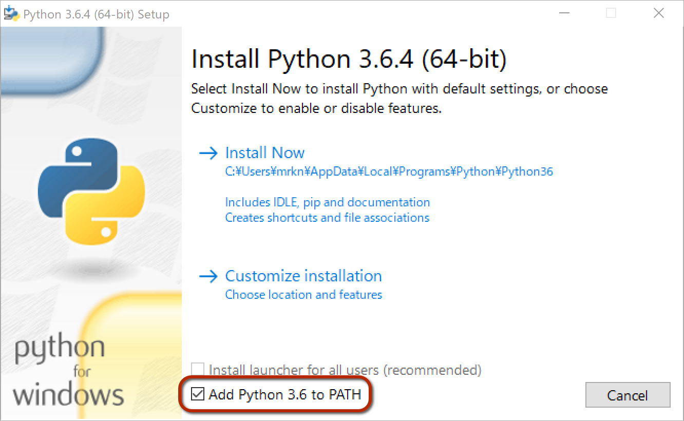
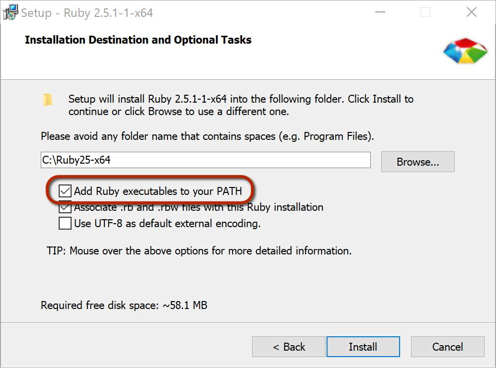
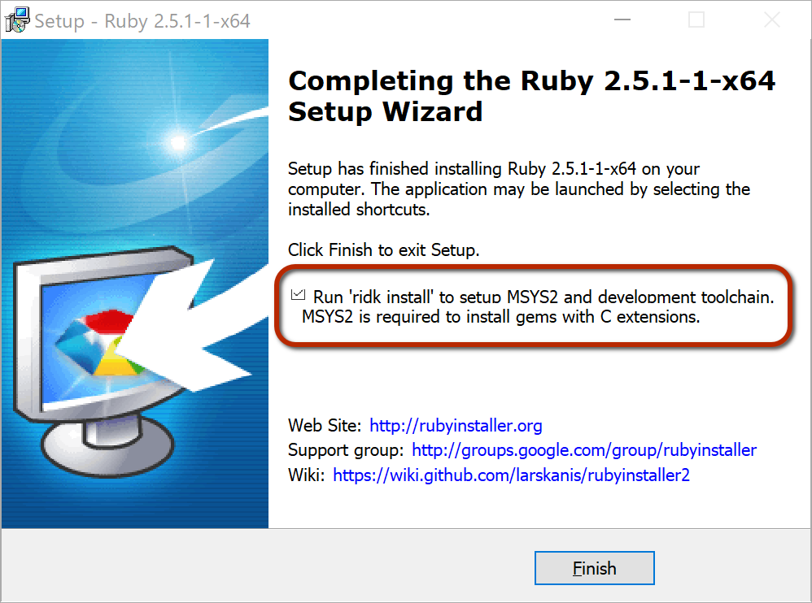

<!-- markdownlint-disable MD024 -->

# IRuby インストールガイド

本ガイドでは、IRuby を利用するための環境の作り方を、次の主要オペレーティングシステム (以下、OS と略す) 別に解説します。

- Ubuntu Linux
- macOS
- Windows

また、上記以外の OS を利用している場合を含め、Docker を利用したい場合のために、Docker による環境構築についても述べました。

## IRuby を利用するために必要なもの

[IRuby](https://github.com/sciruby/iruby) は [Jupyter](http://jupyter.org/) 上で Ruby を利用するためのカーネルです。IRuby を利用するには次の環境をすべて揃える必要があります。

- IRuby を利用するために必要なもの
  - Jupyter を利用するための環境
  - Ruby の実行環境
  - IRuby
  - IRuby が利用する ZMQ ライブラリ
- Jupyter を利用するために必要なもの
  - Python の実行環境
  - Jupyter

Jupyter を利用する場合、多くの人はウェブブラウザから Jupyter Notebook として利用すると思います。Jupyter Notebook 上で IRuby を利用するには下記の環境を揃える必要があります。

- Jupyter Notebook 上で IRuby を利用するために必要なもの
  - Jupyter を利用するための環境
  - IRuby を利用するための環境
  - ウェブブラウザ

以下では、主要 OS を対象に、OS ごとに Jupyter と IRuby を利用するための環境構築手順を解説します。

Python と Ruby はそれぞれ本稿執筆時点での最新版である Python 3.6.4 と Ruby 2.5.1 を利用します。

## Ubuntu Linux の場合

Ubuntu Linux については 16.04 LTS と 18.04 LTS の2バージョンを対象に説明します。

### Python のインストール

#### Ubuntu 16.04 LTS の場合

Ubuntu 16.04 LTS の公式 python3 パッケージは Python 3.5 です。Ubuntu 16.05 LTS で最新版の Python 3.6.4 を利用するには、[PPA で提供されているパッケージ](https://launchpad.net/~deadsnakes/+archive/ubuntu/ppa)を使います。

```console
sudo add-apt-repository ppa:deadsnakes/ppa
sudo apt-get update
sudo apt-get install python3.6
```

#### Ubuntu 18.04 LTS の場合

Ubuntu 18.04 LTS では、公式の `python3.6` パッケージが Python 3.6.4 です。おそらく、OS をインストールした時点で既に `python3` コマンドが使用でき、その Python がバージョン 3.6.4 になっています。もし、`python3` コマンドが使用できない場合は、次のように `apt install` コマンドでインストールしてください。

```console
sudo apt install python3.6
```

Python でのパッケージ管理を `pip3` コマンドで行うために、`python3-pip` パッケージをインストールする必要があります。

```console
sudo apt install python3-pip
```

### Jupyter のインストール

Jupyter は `pip3` コマンドを用いてインストールします。

```console
pip3 install jupyter
```

### Ruby のインストール

まず、Ruby をインストールするために必要なツールとライブラリを準備します。次のコマンドで必要なツールとライブラリのパッケージをインストールしましょう。

```console
sudo apt install libgmp-devel libffi-dev libyaml-dev libssl-dev bison libgdbm-dev libreadline6-dev
```

Ruby そのもののインストール方法については、後述の「rbenv と ruby-build を利用した Ruby 環境の構築」セクションを参照してください。

### ZeroMQ ライブラリのインストール

IRuby を動作させるために必要となる ZeroMQ ライブラリを準備します。IRuby では cztop ライブラリを利用します。cztop を使用するには、ライブラリのバージョンについて次の条件を満たす必要があります。

- ZMQ ≥ 4.2.0
- CZMQ ≥ 4.0.0

#### Ubuntu 16.04 LTS の場合

Ubuntu 16.04 LTS では、公式の ZMQ パッケージがバージョン 4.1.4 なので cztop が利用できません。しかし、次のコマンドで opensuse が配布しているパッケージをインストールすることで cztop 用の環境を構築できます。

```console
echo 'deb http://download.opensuse.org/repositories/home:/zeromq:/git-draft/xUbuntu_16.04/ /' > sudo sh -c 'cat > /etc/apt/sources.list.d/zeromq.list'
curl -fsSL http://download.opensuse.org/repositories/home:zeromq:git-draft/xUbuntu_16.04/Release.key | sudo apt-key add - \
sudo apt update
sudo apt install libczmq-dev libzmq3-dev
```

#### Ubuntu 18.04 LTS の場合

Ubuntu 18.04 LTS では公式パッケージを利用します。

```console
sudo apt-get install libczmq-dev libzmq3-dev
```

### IRuby のインストール

IRuby、pry、cztop を `gem install` コマンドでインストールします。

```console
gem install iruby pry cztop
```

## macOS の場合

macOS については Homebrew を利用することを前提に環境構築の手順を説明します。

### Command Line Tools または Xcode のインストール

Homebrew をインストールするために、Command Line Tools または Xcode をインストールする必要があります。

Command Line Tools の場合は次のコマンドを実行して表示される指示に従ってください。

```console
xcode-select --install
```

Xcode の場合は、App Store でインストールするか <https://developer.apple.com/downloads> から Xcode をダウンロードしてインストールしてください。

### Homebrew のインストール

Homebrew は、<https://brew.sh/> に記載されている次のコマンドを実行することでインストールできます。

```console
/usr/bin/ruby -e "$(curl -fsSL https://raw.githubusercontent.com/Homebrew/install/master/install)"
```

### Python のインストール

次のコマンドで `python3` をインストールしてください。

```console
brew install python3
```

### Jupyter のインストール

Jupyter は `pip3` コマンドでインストールします。

```console
pip3 install jupyter
```

### Ruby のインストール

まず、Ruby をビルドするために必要なライブラリとツールをインストールします。

```console
brew install gmp libyaml readline openssl gdbm
```

Ruby そのもののインストール方法については、後述の「rbenv と ruby-build を利用した Ruby 環境の構築」セクションを参照してください。

### ZeroMQ ライブラリのインストール

cztop を利用するために、次のように `--HEAD` オプションを指定して `zeromq` と `czmq` をインストールします。

```console
brew install zeromq --HEAD
brew install czmq --HEAD
```

cztop が `libzmq.dylib` と `libczmq.dylib` を見つけられるよう、`.bash_profile` などのシェルの初期化スクリプトに次のコードを追記してください。

```sh
export LIBZMQ_PATH=$(brew --prefix zeromq)/lib
export LIBCZMQ_PATH=$(brew --prefix czmq)/lib
```

### IRuby のインストール

IRuby、pry、cztop を `gem install` コマンドでインストールします。

```console
gem install iruby pry cztop
```

## Windows の場合

ここでは Windows 10 (64bit) を対象にインストール方法を説明します。

### Python のインストール

次の URL から Python 3.6.4 のインストーラをダウンロードし、実行してインストールしてください。

<https://www.python.org/ftp/python/3.6.4/python-3.6.4-amd64.exe>

インストールされた Python に適切にパスを通すため、インストーラの以下の画面で、赤枠で囲んだチェックボックスをチェックしてください。



### Jupyter のインストール

Python コンソールを起動し、次のコマンドを実行して Jupyter をインストールしてください。

```console
pip install jupyter
```

### Ruby のインストール

次の URL から Ruby 2.5.1 のインストーラをダウンロードし、実行してインストールしてください。

<https://github.com/oneclick/rubyinstaller2/releases/download/rubyinstaller-2.5.1-1/rubyinstaller-2.5.1-1-x64.exe>

インストールされる Ruby に適切にパスを通すため、インストーラの以下の画面で、赤枠で囲んだチェックボックスをチェックしてください。



また、インストーラのインストール完了画面に表示されるチェックボックス (下図の赤枠) をチェックした状態で完了すると、拡張ライブラリの開発で必要な MSYS2 の環境のインストールが開始されます。開発環境が必要な場合はインストールしておくと良いでしょう。MSYS2 の環境は後でもインストールできるので、チェックを外して完了しても問題ありません。



### ZeroMQ ライブラリのインストール

Windows では ZeroMQ ライブラリを個別にインストールする必要はありません。理由は、次のセクションでインストールされる czmq-ffi-gen gem が ZeroMQ ライブラリを含んでいるからです。

### IRuby のインストール

IRuby、pry、cztop を `gem install` コマンドでインストールします。

```console
gem install iruby pry cztop
```

前のセクションで言及した czmq-ffi-gen gem は cztop gem の依存関係としてインストールされます。

## Docker を使う場合

Docker を利用すると、[RubyData](http://ruby-data.org/) が整備している `rubydata/notebooks` という Docker イメージが利用できます。

### イメージの取得

`rubydata/notebooks` イメージを取得するために、次のコマンドを実行してください。

```console
docker pull rubydata/notebooks
```

### コンテナの起動

次のコマンドを実行すると、Jupyter notebook が Docker コンテナとして起動します。

```console
docker run -it --rm -p 8888:8888 rubydata/notebooks
```

コンテナに対するオプションの指定方法などの詳細は、次の文書を参照してください。

<https://github.com/RubyData/docker-stacks/tree/master/notebooks>

## rbenv と ruby-build を利用した Ruby 環境の構築

Linux や macOS などの UNIX 系 OS では、rbenv と ruby-build を用いることで Ruby の実行環境を導入できます。

### rbenv と ruby-build の取得と配置

まず、rbenv と ruby-build をダウンロードして適切な場所に配置します。次の2つのコマンドを実行すると、両者を github からクローンし、ホームディレクトリの下に配置します。

```console
git clone git@github.com:rbenv/rbenv.git ~/.rbenv
git clone git@github.com:rbenv/ruby-build.git ~/.rbenv/plugins/ruby-build
```

rbenv を有効にするには、環境変数などの設定が必要です。そのために `.bash_profile` や `.bashrc` など、シェルが起動時に読み込む設定用スクリプトファイルに次のコードを追記してください。

```sh
export PATH=~/.rbenv/bin:$PATH
eval "$(rbenv init -)"
```

そして、シェルを起動しなおすと rbenv が有効になります。

### Ruby 2.5.1 のインストール

Ruby のインストールは `rbenv install` コマンドにインストールしたい Ruby のバージョンを指定するだけです。

#### macOS 以外の OS の場合

次のコマンドを実行し、Ruby 2.5.1 をインストールしましょう。

```console
rbenv install 2.5.1
```

#### macOS の場合

macOS では、Ruby をビルドする際に利用するライブラリ群の場所を `configure` スクリプトに指定するため、次のように `CONFIGURE_OPTS` 環境変数を定義してから `rbenv install` コマンドを実行してください。

```console
export CONFIGURE_OPTS="--with-opt-dir=$(brew --prefix) --with-openssl-dir=$(brew --prefix openssl) --with-readline-dir=$(brew --prefix readline)"
rbenv install 2.5.1
```

### デフォルトの Ruby バージョンを選択

インストールが完了したら、次のコマンドを実行して、デフォルトの Ruby を Ruby 2.5.1 に設定してください。

```console
rbenv global 2.5.1
```

以上で Ruby 2.5.1 のインストールは完了です。

## Windows での Ruby 拡張ライブラリ開発環境の構築

### ridk コマンドによる開発環境のインストール

Windows において、Ruby 拡張ライブラリの開発環境を Ruby インストール時にインストールしなかった場合、次のコマンドをコマンドプロンプトで実行することでインストール可能です。

```console
ridk install
```

このコマンドを実行すると、次のメッセージが表示され、番号の入力待ちになります。

```console
> ridk install
C:\Users\mrkn>ridk install
 _____       _           _____           _        _ _         ___
|  __ \     | |         |_   _|         | |      | | |       |__ \
| |__) |   _| |__  _   _  | |  _ __  ___| |_ __ _| | | ___ _ __ ) |
|  _  / | | | '_ \| | | | | | | '_ \/ __| __/ _` | | |/ _ \ '__/ /
| | \ \ |_| | |_) | |_| |_| |_| | | \__ \ || (_| | | |  __/ | / /_
|_|  \_\__,_|_.__/ \__, |_____|_| |_|___/\__\__,_|_|_|\___|_||____|
                    __/ |           _
                   |___/          _|_ _  __   | | o __  _| _     _
                                   | (_) |    |^| | | |(_|(_)\^/_>

   1 - MSYS2 base installation
   2 - MSYS2 system update (optional)
   3 - MSYS2 and MINGW development toolchain

↑Which components shall be installed? If unsure press ENTER [1,2,3]
```

ここで `3` を入力すると、MSYS2 と MINGW 開発環境がインストールされます。

ここで

```
MSYS2 could not be found. Please run 'ridk install'
or download and install MSYS2 manually from https://msys2.github.io/
```

このようなメッセージが表示されてしまう場合は、先に MSYS2 を手動でインストールする必要があります。次のセクションに従い MSYS2 をインストールし、それから再度このセクションの最初に戻って環境構築をしてください。

### MSYS2 のインストール

MSYS2 のトップページ <https://msys2.github.io> に掲載されている `msys2-x86_64-YYYYMMDD.exe` というファイル名 (`YYYYMMDD` は年月日です) のインストーラをダウンロードし実行してください。

## まとめ

本ガイドでは、IRuby を利用するための環境の作り方について述べました。また、Windows における開発環境の構築方法についても述べました。
