<!-- markdownlint-disable MD033 -->

# IRuby Notebook 利用者ガイド

本ガイドでは IRuby Notebook の利用方法を解説しています。IRuby をまだインストールされていない場合は、先に「IRuby インストールガイド」をご覧になり、IRuby をインストールしてから本ガイドを参照してください。

## IRuby Notebook とは

### Jupyter と IRuby

[Jupyter](http://jupyter.org) はインタラクティブなプログラミング環境です。irb や pry を高度にしたものと考えて差し支えありません。IRuby は、Jupyter 上で Ruby を利用できるようにするためのカーネルです。

### Jupyter Notebook と IRuby Notebook

[Jupyter Notebook](https://jupyter-notebook.readthedocs.io/en/stable/) は Jupyter を Web ブラウザ上で利用できるようにし、さらにコードの実行履歴とその説明を文書として保存できるようにしたものです。

IRuby カーネルを用いて Ruby をメインのプログラミング言語とした状態の Jupyter Notebook を IRuby Notebook と呼びます。

#### 他のプログラミング言語の場合

Python には IPython カーネルが、Julia には IJulia カーネルがあります。Jupyter Notebook でそれぞれのカーネルを利用する状態を IPython Notebook、IJulia Notebook と呼び分けます。

## IRuby Notebook でできること

### 起動

IRuby Notebook を起動するには、Linux や macOS の場合は端末エミュレータで、Windows の場合はコマンドプロンプトで次のコマンドを実行します。

```console
iruby notebook
```

オペレーティングシステム (以下、OS と略す) のデフォルト Web ブラウザのウィンドウ (またはタブ) が開いて、Jupyter Notebook のファイルリスト画面が表示されます。ファイルリスト画面に表示されているのは、上記コマンド実行時の作業ディレクトリの中身です。

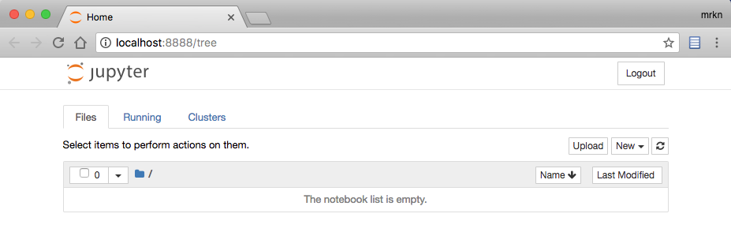

#### Docker イメージを使用する場合

Docker の `rubydata/notebooks` イメージを利用する場合は、次のコマンドで IRuby Notebook を起動します。

```console
docker run -it --rm -p 8888:8888 -v $(pwd):/home/jovyan/work rubydata/notebooks
```

正常に起動すると、次のようなメッセージが出力されます。

```plain
    Copy/paste this URL into your browser when you connect for the first time,
    to login with a token:
        http://localhost:8888/?token=ee65e85fd6439f0a62facd68c00b07d08f635e2ea745f152
```

この URL を Web ブラウザで開けば、次の図に示したようなファイルリストが表示されます。

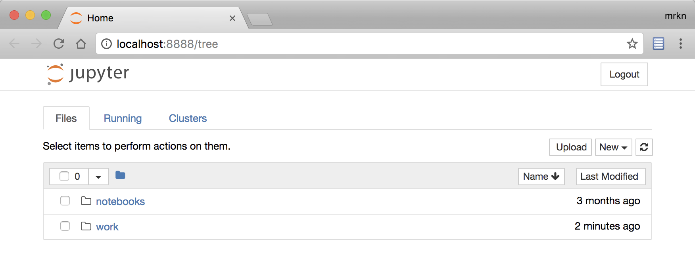

`docker run` コマンドに指定した `-v $(pwd):/home/jovyan/work` オプションによって、ファイルリスト中の `work` ディレクトリがカレントディレクトリにバインドされています。その中にノートブックを作成すると、Docker コンテナ内ではなくホスト側のカレントディレクトリにファイルが作成されます。

### ノートブックの新規作成

ノートブックを作成するには、ファイルリストの右上にある [New] ボタンをクリックし、表示されたドロップダウンメニューから [Notebook: Ruby 2.5.0] を選択します。

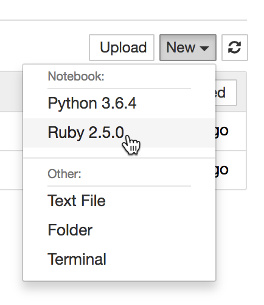

ブラウザの新規タブに新しいノートブックが作成されます。

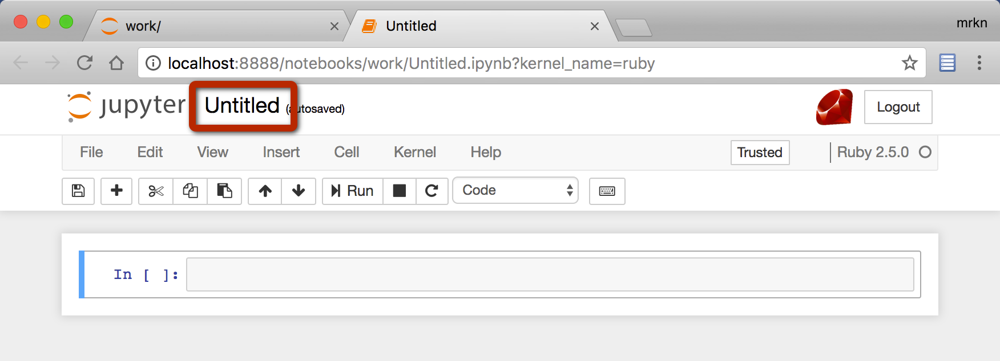

図で赤く囲んだ `Untitled` はノートブックの名称 (ファイル名) です。ここをクリックするとノートブックの名前を変更できます。

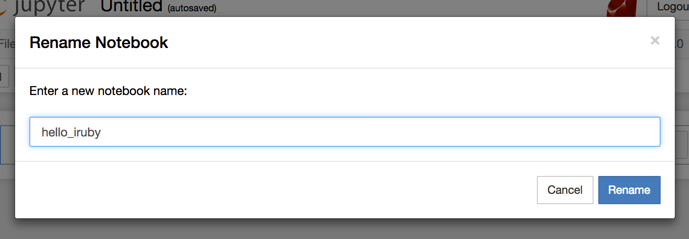

### Ruby コードを実行する

#### コード実行

`In []:` の隣にあるテキストボックスは、コードを入力するセルです。これをコードセルと呼びます。コードセルに次のコードを入力してください。

```ruby
puts "Hello IRuby"
```

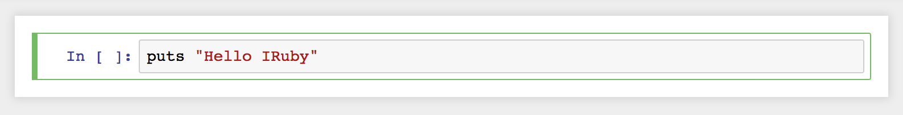

コードセルを選択した状態で <kbd>Shift</kbd>+<kbd>Enter</kbd> を押すとコードが実行されます。実行結果はコードセルの直下に表示されます。

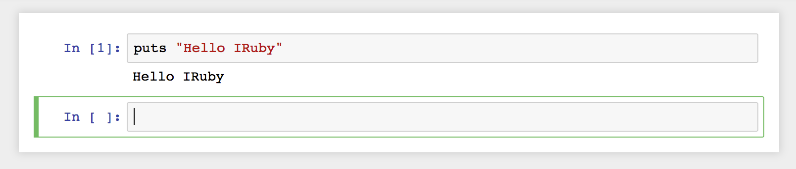

`puts` によって標準出力へ書き出された文字列 `Hello IRuby` がコードセルの下に表示されています。そして、その下に空のコードセルが追加されています。ここにコードを入力して実行することで、次々とコードを実行していけます。

さらに次のコードを新しく追加されたセルに入力して実行して見てください。

```ruby
p 'Hello IRuby'
```

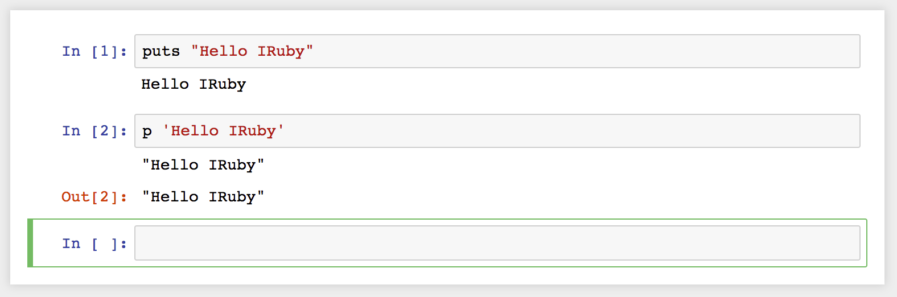

出力結果は2行になりました。1行目は `p` によって標準出力に書き出された文字列です。2行目の `Out[2]:` に続く値はコードの実行結果を `inspect` した結果です。`puts` は `nil` を返しますが、`p` は引数をそのまま返します。IRuby はコードの実行結果が `nil` 以外の時に、その値を `inspect` した結果を `Out[]:` の行に表示します。ですから、結果の欄に `Out[]:` があるかどうかで、標準出力に書き出されたものか、コードの実行結果かを判別できます。

#### 変数やメソッドを定義して利用する

次のコードをコードセルに入力して実行し、変数 `radius` とメソッド `circle_area` を定義して使用してみましょう。

```ruby
radius = 15.0

def circle_area(r)
  r ** 2 * Math::PI
end

circle_area(radius)
```

すると、実行結果として `706.8583470577034` が表示されたと思います。

続いて、いま実行したコードセルとは別のコードセルに次のコードを入力して実行してみてください。

```ruby
circle_area(radius + 1)
```

すると、実行結果として `804.247719318987` が表示されたと思います。このように、一度セル内で定義した変数と関数は他のセルから参照できるのです。

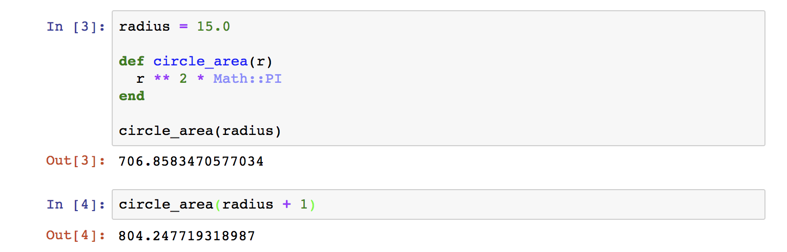

### 過去の実行結果の参照

`Out []:` の番号が付与された実行結果は IRuby が記録していて、`Out[3]` のように参照できます。次の図のように、セルに `circle_area(radius)` を実行したセル番号 (図では 3) を `Out` の添字に指定して実行してみてください。実行結果に `706.8583470577034` と出るはずです。

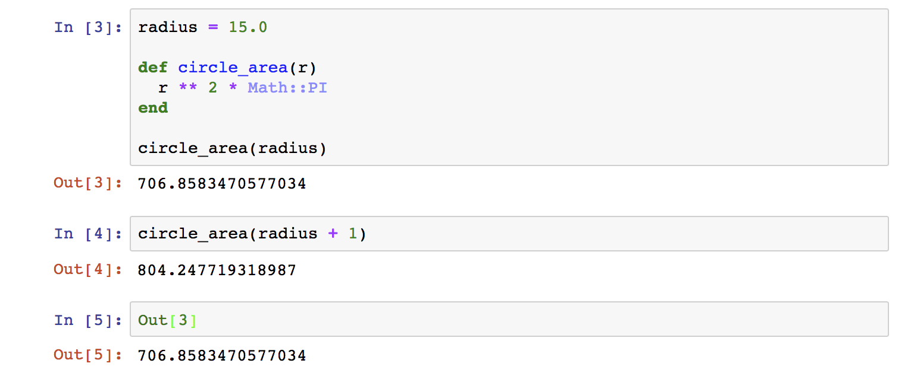

### コードセルの番号

コードセルの `In []:` と `Out []:` の番号は、セルが実行されるたびに増加していきます。同じコードセルを何度も実行したり、前のセルへ戻って再実行したりすると、この番号が昇順に並ばないことになります。この状態が気になる場合は、[Kernel] メニューの [Restart & Run All] を選択することで、コードセルの番号を1から採番しなおして全コードセルを上から順に1回ずつ再実行します。そうすることで、コードセルの番号が上から昇順に綺麗に並びます。

### 標準出力と標準エラー出力

`$stdout` や `$stderr` に対して出力された文字列は、ノートブックのコードセルの下に表示されます。`$stderr` に対して出力された文字列の背景はピンクで装飾されます。以下に例を示します。

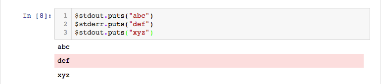

#### 構文エラーと例外の表示

コードセル内に記述したコードにミスがあった場合、結果の欄には発生した例外メッセージが表示されます。

まずは、文法エラーの場合を見てみましょう。次のコードを実行してください。

```ruby
ary = [ 1, 2, 3, [, 5]
```

実行結果の欄に次のエラーメッセージが表示されていると思います。

```plaintext
SyntaxError: unexpected ',', expecting ']'
ary = [ 1, 2, 3, [, 5]
                  ^
```

**※** コードセル内で StandardError を継承していない例外 (SyntaxError など) が発生すると、`Out` の添字がセル番号とズレてしまいます。これは IRuby のバグであり、すぐに修正される予定です。

続いて実行時に例外が起きる場合を見てみましょう。次のコードを実行してください。

```ruby
def foo
  bar
end

def bar
  raise "error!!!"
end

foo
```

このコードは、foo → bar と呼び出しが続き、メソッド bar の中で RuntimeError が発生します。実行結果欄に次のような例外メッセージとバックトレースが表示されているはずです。

```plain
RuntimeError: error!!!
(pry):29:in `bar'
(pry):25:in `foo'
(pry):33:in `<main>'
/usr/local/bundle/gems/pry-0.11.3/lib/pry/pry_instance.rb:355:in `eval'
    (以下略)
```

**※** 現在の IRuby は、バックトレースで表示される行番号がコードセル内の行番号ではなく、ノートブック内で実行した全てのコードにおける行番号になってしまうバグが存在します。

### IRuby.display によるオブジェクトの表示

`IRuby.display` メソッドを利用すると、HTML や画像などのプレインテキスト以外のデータをノートブックに埋め込むことができます。例えば、次のコードを実行するとセルの直下に表が埋め込まれます。

```ruby
IRuby.display(<<TABLE, mime: 'text/html')
<table>
<tr><th>a</th><th>b</th></tr>
<tr><td>1</td><td>2</td></tr>
<tr><td>3</td><td>4</td></tr>
</table>
TABLE
```

実行結果は次の図のようになります。

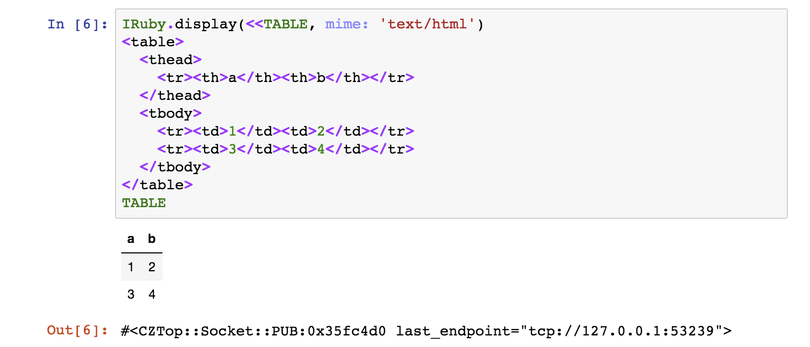

次の例は red-data-tools のロゴ画像をダウンロードし、それをノートブックに埋め込みます。

```ruby
require 'open-uri'

rdt_logo_url = 'https://github.com/red-data-tools/resources/raw/master/logo/RDT_logo.png'
URI.parse(rdt_logo_url).open('rb') do |io|
  data = io.read
  IRuby.display(data, mime:'image/png')
end
```

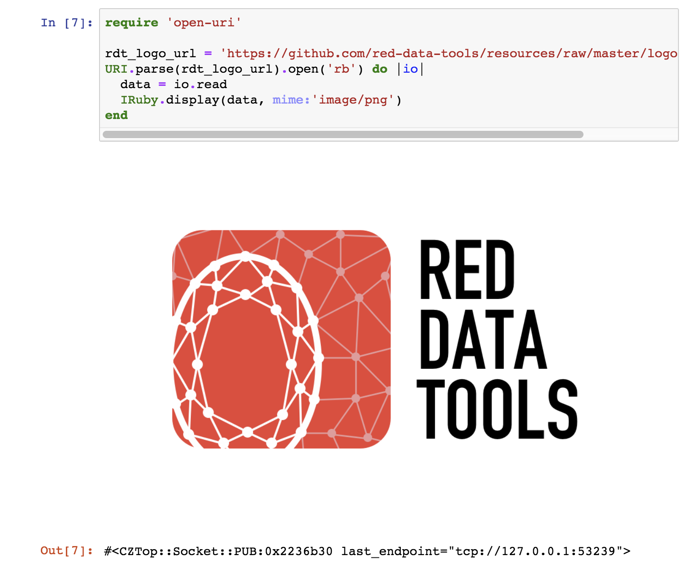

### pycall.rb を利用した matplotlib との連携

matplotlib.rb を利用すると pycall.rb 経由で Python の matplotlib ライブラリを利用してデータを可視化できます。matplotlib が IPython との連携機能を持っているように、matplotlib.rb も IRuby との連携機能を持っています。この連携機能を有効にすると、コードセル内で作成された matplotlib の図が自動的にノートブック内に埋め込み表示されます。使って見ましょう。

matplotlib.rb の IRuby 連携機能を有効にするには、次のコードのように `Matplotlib::IRuby.activate` を呼び出します。

```ruby
require 'matplotlib/iruby'
Matplotlib::IRuby.activate
```

次のコードを実行してみましょう。

```ruby
sample = Array.new(10000) { rand }
require 'matplotlib/pyplot'
Matplotlib::PyPlot.hist(sample, bins: 50)
```

次のような実行結果になります。

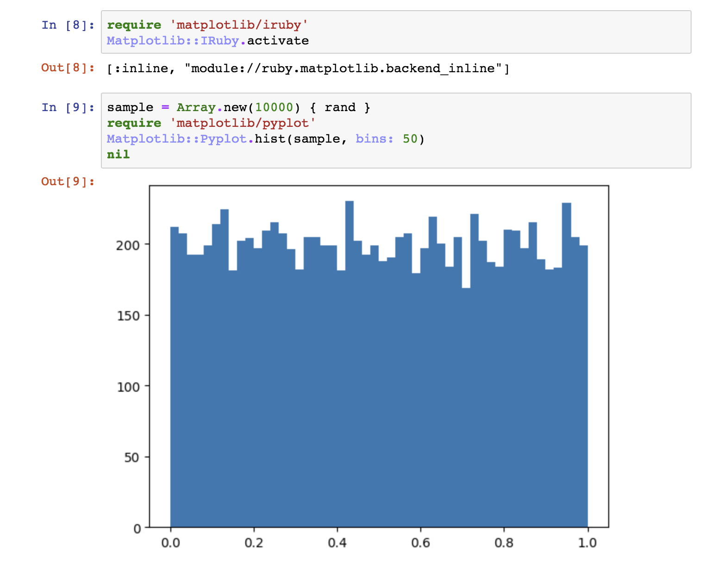

この例のように、明示的に図を表示するメソッドを呼び出さなくても作成した図が表示されます。

### ノートブック画面の機能

**TODO:**

### Markdown セルを利用する

**TODO:**

### 保存と共有

#### ipynb ファイル

**TODO:** ipynb ファイルに保存される。JSON 形式。

#### GitHub での公開

**TODO:** ipynb ファイルをcommit & pushすると、PC view ではレンダリングされる。

#### nbviewer による表示

**TODO:** GitHub でレンダリングされない図などを表示できる。社外秘情報を含むノートブックを共有するために社内に nbviewer を設置しておくと良い。

## IPython Notebook との違い

IRuby は IPython と異なりとてもシンプルに作られています。そのため、以下の機能を持っていません。

- 高度な補完機能
- マジックコマンド

これらの機能は IRuby にも是非欲しいので、腕に自信がある方はぜひ実装にチャレンジして GitHub の sciruby/iruby まで pull request を送ってください。

## まとめ

本ガイドでは IRuby Notebook の使い方を説明しました。