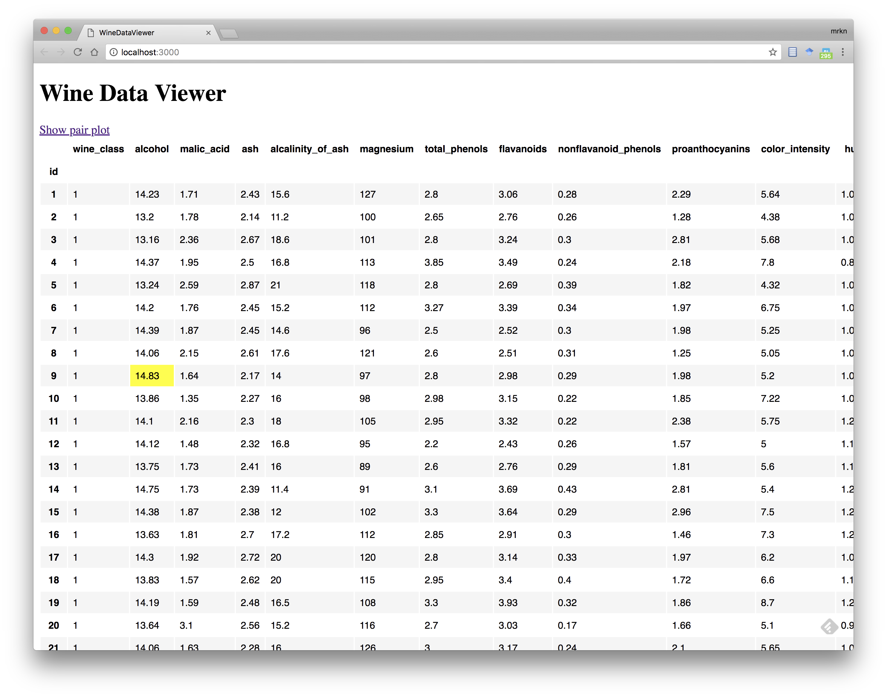
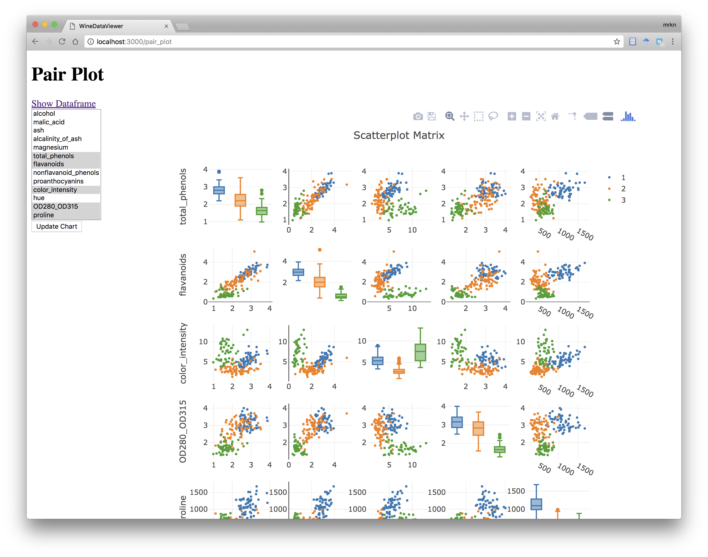

# pycall.rb による Rails と Python データツールの統合

## はじめに

本ガイドは、pycall.rb を利用して Rails アプリケーションと Python データツールを統合する方法を解説します。

## サンプルアプリケーションについて

本ガイドでは、構築済みの Rails アプリケーションのコードを参照しながら、Rails と Python データツールの統合方法を解説します。
参照するアプリケーションは下記の GitHub リポジトリにあります。

<https://github.com/RubyData/wine_data_viewer>

### アプリケーションの概要

このアプリケーションは、UCI Machine Learning Repository の Wine Data Set を可視化する Rails アプリケーションです。このデータは下記サイトで配布されています。

<https://archive.ics.uci.edu/ml/datasets/wine>

このデータを可視化するために Python の pandas と plotly の2つのライブラリを利用します。そのため、このアプリケーションは Rails アプリケーションと Python のデータツールとの統合の良いサンプルになるでしょう。

### アプリケーションを動かす

アプリケーションを clone して動かしてみましょう。下記の一連のコマンドを実行することで、アプリケーションのコードを clone し、必要なライブラリ群をインストールできます。

```console
git clone git@github.com:RubyData/xxx.git
cd xxx
bundle install
pip3 install -r requirements.txt
```

準備が整ったら、次のコマンドでアプリケーションのデータベースを初期化しましょう。

```console
bundle exec rake db:seed
```

データベースの準備が済んだら、次のコマンドでアプリケーションを起動してください。

```console
rails start
```

サーバが起動したら <http://localhost:3000> にアクセスしましょう。

### アプリケーションの機能

このアプリケーションには2つの機能があります。1つはトップページで全データを表形式で表示する機能です。もう一つは、選択したカラムについて pairplot を表示する機能です。両機能のスクリーンショットを以下に示します。





## ActiveRecord と pandas の統合

pandas による表形式の可視化も、plotly による pairplot の可視化も、どちらもデータを pandas のデータフレーム形式で与える必要があります。ActiveRecord モデルから pandas 形式のデータフレームを生成するには、pandas gem によって拡張されたメソッド `Pandas.read_sql_table` が利用できます。この拡張されたメソッドは、第1引数に ActiveRecord のモデルクラスを与えると、それをテーブル名とコネクションのペアとして利用します。

これを利用し、`WineObservation` モデルからデータフレームを生成するクラスメソッド `to_pandas` を、次の要件を満たすように定義します。

1. `id` カラムをインデックスとする
2. `wine_class` カラムは文字列型とする

メソッドの実装は次の通りです。

```ruby
class WineObservation < ApplicationRecord
  def self.to_pandas
    df = Pandas.read_sql_table(WineObservation, nil, index_col: :id)
    df['wine_class'] = df['wine_class'].astype(:str)
    df
  end
end
```

## 可視化結果の埋め込み

### pandas による表形式での可視化

表形式での可視化は `WineObservationsController#index` が担当します。まず、`WineObservationsController` クラスの全体を見てみましょう。

```ruby
require 'pandas'

class WineObservationsController < ApplicationController
  def index
    @dataframe = load_dataframe
  end

  private def load_dataframe
    # TODO: fix pandas.rb
    WineObservation.to_pandas
  end

  helper_method def render_dataframe(df)
    highlight_max = lambda do |seq|
      max_p = seq == seq.max()
      max_p.tolist.map {|f| f ? 'background-color: yellow' : '' }
    end
    target_columns = df.columns[1..-1] # except wine_classes
    df.style.apply(highlight_max, subset: target_columns)._repr_html_.html_safe
  end
end
```

続いて、`app/vies/wine_observations/index.html.haml` です。

```haml
%h1 Wine Data Viewer

.nav
  = link_to "Show pair plot", pair_plot_path

.dataframe
  = render_dataframe @dataframe
```

ビューで参照されている `@dataframe` は `WineObservations.to_pandas` で生成されたデータフレームを参照してます。このデータフレームはヘルパメソッド `render_dataframe` に渡されています。つまり、可視化処理の実態は `render_dataframe` の中にあります。

では、`render_dataframe` の実装をもう一度見てみましょう。

```ruby
class WineObservationsController < ApplicationController
  # (略)

  helper_method def render_dataframe(df)
    highlight_max = lambda do |seq|
      max_p = seq == seq.max()
      max_p.tolist.map {|f| f ? 'background-color: yellow' : '' }
    end
    target_columns = df.columns[1..-1] # except wine_classes
    df.style.apply(highlight_max, subset: target_columns)._repr_html_.html_safe
  end
end
```

しかし、このアプリケーションでは、表スタイル指定のために pandas のスタイリング機能を利用しています。データフレームの `style` 属性で取り出せるスタイリングオブジェクトのメソッド `apply` でスタイルを適用し、`_repr_html_` メソッドで HTML 形式へ変換します。その結果は文字列なので、さいごに `html_safe` を呼び出します。

スタイリングオブジェクトの `apply` メソッドは、第1引数に `Proc` オブジェクトなどの呼び出し可能オブジェクトを指定します。この呼び出し可能オブジェクトには、表のカラムに対応する pandas の `Sequence` オブジェクトが渡され、戻り値はその `Sequence` オブジェクトの各要素 (つまり各セル) に対するスタイルシートの配列です。`apply` メソッドには `subset:` キーワード引数で、スタイル指定対象のカラム名を指定できます。

`WineObservationController` の `render_dataframe` では、`wine_classes` カラム以外のカラムに対し、最大値の背景色を黄色に指定しています。

pandas のスタイリング機能の詳細は次のドキュメントを参照してください。

<https://pandas.pydata.org/pandas-docs/stable/style.html>

### plotly による pairplot での可視化

plotly による pairplot の可視化は `PairPlotController` の `show` アクションが担当します。このコントローラの実装を見てみましょう。

```ruby
require 'plotly'

class PairPlotController < ApplicationController
  DEFAULT_COLUMNS = %i[
    total_phenols
    flavanoids
    color_intensity
    OD280_OD315
    proline
  ].freeze

  def show
    @columns = DEFAULT_COLUMNS
    @dataframe = load_dataframe
  end

  def update
    @columns = params[:columns].reject(&:blank?)
    @dataframe = load_dataframe
    render 'show'
  end

  private def load_dataframe
    WineObservation.to_pandas
  end

  helper_method def render_pairplot(df, columns: nil, height: 800, width: 800)
    columns ||= DEFAULT_COLUMNS
    fig = Plotly::FF.create_scatterplotmatrix(
      df[[:wine_class, *columns]], index: :wine_class, diag: 'box',
      size: 4, height: height, width: width)
    Plotly::Offline.plot(fig, output_type: 'div').html_safe
  end
end
```

`show` アクションのビューテンプレートも見てみましょう。

```haml
%h1 Pair Plot

.nav
  = link_to "Show Dataframe", root_path

#form
  = render 'form', dataframe: @dataframe, columns: @columns

#chart
  = render_pairplot(@dataframe, columns: @columns)
```

可視化対象のカラムを選択するフォームの下にある `#chart` 要素の中が pairplot です。可視化処理の実態は `render_pairplot` です。

では、`render_pairplot` の実装をもう一度見てみましょう。

```ruby
class PairPlotController < ApplicationController
  # 略

  helper_method def render_pairplot(df, columns: nil, height: 800, width: 800)
    columns ||= DEFAULT_COLUMNS
    fig = Plotly::FF.create_scatterplotmatrix(
      df[[:wine_class, *columns]], index: :wine_class, diag: 'box',
      size: 4, height: height, width: width)
    Plotly::Offline.plot(fig, output_type: 'div').html_safe
  end
end
```

最初の引数はデータフレームです。`columns:` キーワード引数で可視化対象のカラム名を受け取り、指定されなかった場合は `DEFAULT_COLUMNS` の値を利用しています。

plotly において、pairplot 図は関数 `plotly.figure_factory.create_scatterplotmatrix` で作成します。ヘルパメソッド内で呼ばれているメソッド `Plotly::FF.create_scatterplotmatrix` はこの関数への委譲です。`Plotly` モジュールは、このアプリケーションの `lib/plotly.rb` で次のように定義されています。

```ruby
require 'pycall'

Plotly = PyCall.import_module('plotly')
module Plotly
  PyCall.import_module('plotly.figure_factory')
  PyCall.import_module('plotly.offline')

  FF = self.figure_factory
  Offline = self.offline
end
```

ヘルパメソッド `render_pairplot` の中で参照されている `Ploty::FF` と `Plotly::Offline` はそれぞれ `plotly.figure_factory` モジュールと `plotly.offline` モジュールのラッパーオブジェクトになっています。そして `Plotly::FF.create_scatterplotmatrix` と同様に、`Plotly::Offline.plot` も関数 `plotly.offline.plot` への委譲です。この関数は、引数で与えられた図のオブジェクトを HTML 形式に変換します。

このように、plotly の機能をそのまま利用し、生成された HTML 断片を view の中に埋め込むだけで可視化が完了します。

## まとめ

本ガイドでは Rails アプリケーションの中で Python データツールを利用し、データフレームを操作したり、可視化の結果をビューに埋め込む方法を実例を通して学びました。
